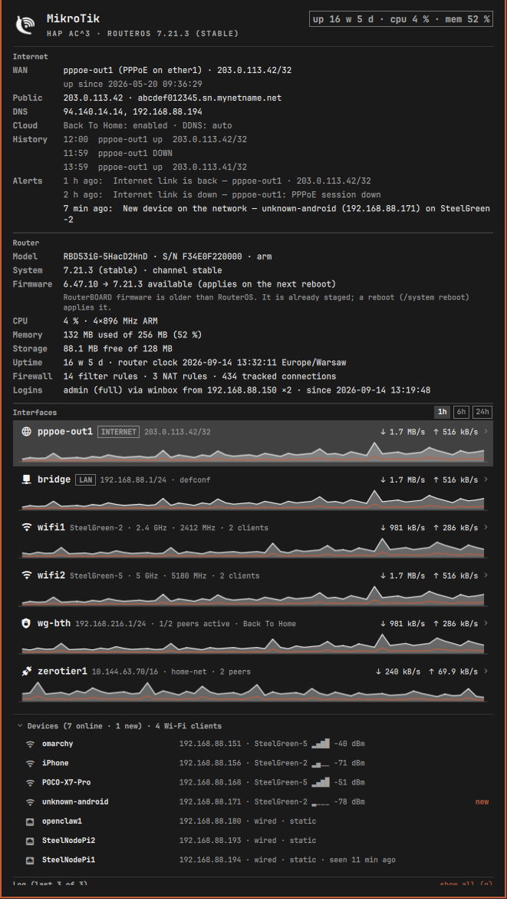
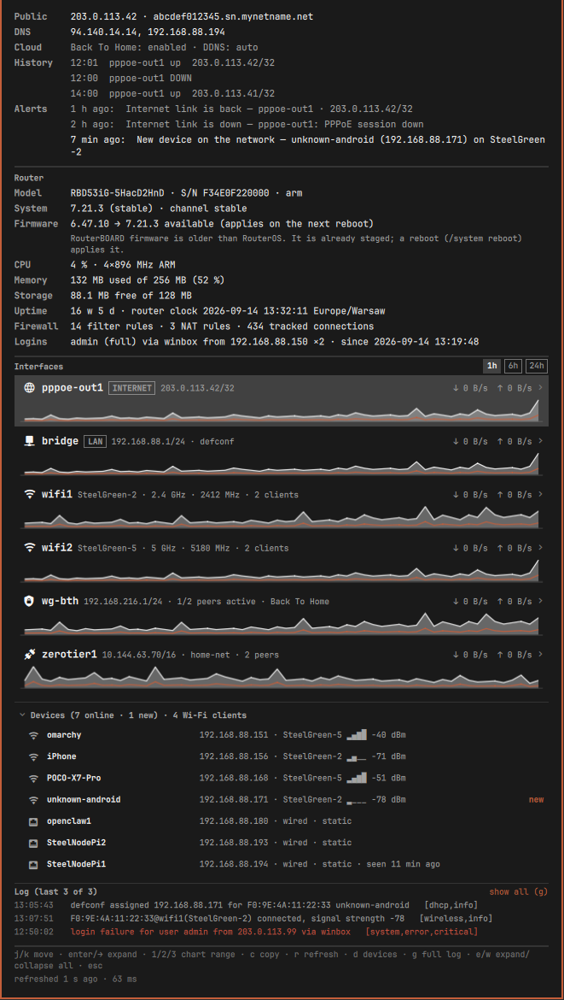

# Banatik

**Your MikroTik router in the Omarchy bar.**

Banatik asks a RouterOS device over its REST API, with a read-only user and a
pinned certificate, and shows what matters in one panel: is the internet link
up and since when, what the public address is, how the router is doing (CPU,
memory, storage, uptime, pending firmware), every interface with live rates and
24 h charts, the Wi-Fi radios and every client with its signal, the DHCP
devices, ZeroTier and WireGuard / Back To Home peers, who is logged into the
router, firewall counters and the router log. It notifies you when the internet
link drops or returns, the public IP changes, a device you have never seen
joins the network, someone logs into the router from a new address, or the
router reboots.

Nothing runs on the router except `GET` and the read-only `print` verb. The
plugin cannot change anything there even if it wanted to: the RouterOS user it
uses has no write policy.



## Install

```
omarchy plugin install banan.banatik
```

Then follow [Setup](#setup) once: create a read-only user and a certificate on
the router, and a credentials file on this machine. Until that is done the bar
icon is dimmed and the panel shows the setup card with the same instructions.

## Setup

RouterOS 7.1 or newer with the REST API (it lives in the `www-ssl` service).

### 1. On the router

Paste into a terminal (`ssh admin@router`) or the WinBox *New Terminal*.
Replace `192.168.88.0/24` and `192.168.88.1` with your LAN and router address,
and choose a password.

```
/user group add name=banatik policy=read,api,rest-api,!local,!telnet,!ssh,!ftp,!reboot,!write,!policy,!test,!winbox,!password,!web,!sniff,!sensitive,!romon
/user add name=banatik group=banatik password="CHANGE-ME" address=192.168.88.0/24

/certificate add name=banatik-ca common-name="Banatik CA" key-size=2048 days-valid=3650 key-usage=key-cert-sign,crl-sign
/certificate sign banatik-ca
/certificate add name=banatik-www common-name="192.168.88.1" subject-alt-name=IP:192.168.88.1 key-size=2048 days-valid=3650 key-usage=tls-server
/certificate sign banatik-www ca=banatik-ca
/certificate set banatik-www trusted=yes
/ip service set www-ssl certificate=banatik-www disabled=no address=192.168.88.0/24 tls-version=only-1.2

/certificate print detail where name=banatik-www
```

The group has exactly three policies: `read` (see things), `api` and
`rest-api` (over the API). RouterOS refuses REST for a user without `api`,
which is why it is there; everything else is explicitly denied. The user may
only log in from the LAN. Signing the certificates takes up to a minute on a
small board. Already have a certificate on `www-ssl`? Skip the certificate
lines and pin that one instead.

The last command prints the certificate; note its `fingerprint`.

### 2. On this machine

```
mkdir -p -m 700 ~/.config/banatik
cat > ~/.config/banatik/credentials <<'EOF'
HOST=192.168.88.1
USER=banatik
PASS='the password you chose'
EOF
chmod 600 ~/.config/banatik/credentials
```

Then let the plugin show you the certificate the router presents:

```
python3 ~/.config/omarchy/plugins/banan.banatik/collect.py --fingerprint
```

Compare the SHA-256 with the `fingerprint` from step 1. If they match, add the
`FINGERPRINT=…` line it prints to the credentials file. Banatik refuses to talk
to a router whose certificate does not match; the password is never sent
before that check passes. `PORT=` is optional (default 443).

Right-click the bar icon (or press `r` in the panel) to refresh.

### Log noise

RouterOS writes one `user banatik logged in via rest-api` line to its log per
refresh. Banatik filters those out of the log it shows you, and the default
interval (30 s while the panel is closed) keeps the count modest. To keep them
out of the router's own memory log entirely:

```
/system logging set [find topics=info default=yes] topics=info,!account
```

That also hides other account messages (logins of `admin`), so decide for
yourself. Raising `refreshIntervalSec` is the milder option.

## What you see

**Bar.** A banana with an antenna. Dimmed until the first sample or while
unconfigured, red when the router is unreachable, the internet link is down or
an urgent alert arrived in the last two minutes. Optional label (`showLabel`):
WAN download/upload rate, devices online, or the router's identity. Left click
opens the panel, right click refreshes. Hover shows a summary when
`showTooltip` is on.

**Internet.** The WAN interface and how it is set up (PPPoE on which port,
DHCP, static), its address and gateway, up since when and how many link drops
since boot, the public address as seen by MikroTik's IP cloud, DNS servers,
Back To Home and DDNS state, the last WAN up/down transitions, and the recent
alerts.

**Router.** Model and serial, RouterOS version and channel (and the newer
version if the router has checked for updates), RouterBOARD firmware with a
notice when a newer one is staged and waits for a reboot, CPU load and cores,
memory and storage with percentages, uptime and the router's clock, health
sensors where the board has any, firewall rule and connection counts, and who
is logged in (WinBox, SSH, web) from where and since when.

**Interfaces.** One row per interface that matters: the WAN link, the LAN
bridge, each Wi-Fi radio, tunnels (ZeroTier, WireGuard, L2TP, …) and any
standalone ethernet port. Bridge slaves are folded into the bridge. Each row
shows the address, a role pill (`INTERNET`, `LAN`), live rates and a sparkline;
expand it for the full 24 h chart (1 h / 6 h / 24 h) and details: MAC, MTU,
packets, errors and drops, last link up/down, and

- for Wi-Fi radios: SSID, band and channel, channel width, and every client
  with signal bars, dBm, band, rates and session length;
- for ZeroTier: the instance, its network(s) and status, and each leaf peer
  with its endpoint, latency and number of paths;
- for WireGuard: each peer with endpoint, last handshake, traffic and allowed
  addresses. Peers whose name or comment says Back To Home are labelled so.

History is sampled every 30 s while the bar runs and kept for 24 h in
`~/.cache/omarchy-banatik/history.jsonl`.

**Devices.** Every DHCP lease, online first: name (host name, comment or MAC),
address, wired or Wi-Fi with SSID and signal, static or dynamic, when it was
last seen. Devices first seen in the last hour are tagged `new`. Click copies
the IP, right click the MAC. `d` collapses the list.

**Log.** The last 40 lines of the router log while the panel is open (the last
12 by default, `g` shows all), own REST logins filtered out, errors in red.
Turn it off with `showLog` to save one request per refresh.



## Alerts

The collector remembers what it saw last time (`~/.cache/omarchy-banatik/state.json`,
no credentials in it) and turns differences into alerts. Each is shown in the
panel for 24 h and sent once as a desktop notification:

| Alert | When | Setting |
|---|---|---|
| Internet link down / back | the default route's interface stops or resumes running, the PPPoE session or DHCP lease is lost | `notifyWan` |
| WAN address / public IP changed | the interface address or the IP-cloud public address differs from the last run | `notifyWan` |
| Router rebooted / RouterOS updated | uptime went backwards, version or firmware changed | `notifyWan` |
| New device on the network | a MAC not seen in the last 30 days appears in the DHCP leases or the Wi-Fi registration table | `notifyNewClient` |
| Router login from a new address | an active session (user, address, method) not seen before; urgent when it has the `full` group | `notifyLogin` |

The first run on a machine records and says nothing. Alerts older than ten
minutes never notify (catching up after a suspend is not news).

## Keyboard and mouse

| Key | Action |
|---|---|
| `j` / `k`, arrows | move the cursor |
| `enter`, `→` / `←` | expand / collapse the interface under the cursor; toggle the device list on its header |
| `1` / `2` / `3` | chart range 1 h / 6 h / 24 h |
| `c` | copy the cursor row's address |
| `r` | refresh now |
| `d` | show / hide the device list |
| `g` | full log / last 12 lines |
| `e` / `w` | expand / collapse all interfaces |
| `esc` | close |

Mouse: click a row to expand or copy, right click copies the other thing (MAC
for devices, first address for interfaces).

## Settings (`~/.config/omarchy/shell.json`, the `banan.banatik` entry)

| Key | Default | Meaning |
|---|---|---|
| `refreshIntervalSec` | 30 | refresh interval while the panel is closed (each refresh is one REST login on the router) |
| `openRefreshIntervalSec` | 5 | refresh interval while the panel is open |
| `showLabel` | false | short label next to the icon |
| `labelStyle` | `wan` | `wan` (↓/↑ rate), `clients` (devices online), `identity` (router name) |
| `showTooltip` | false | summary tooltip on hover |
| `iconStyle` | `banana` | `banana` (drawn), `emoji` (🍌), `glyph` (network icon) |
| `showClients` | true | read DHCP leases and ARP (device list, names for Wi-Fi clients) |
| `showLog` | true | fetch the log while the panel is open |
| `notifyWan` | true | link / address / reboot notifications |
| `notifyNewClient` | true | new-device notifications |
| `notifyLogin` | true | new-login notifications |
| `demo` | false | invented router, for screenshots |

`omarchy bar set banan.banatik showLabel true` changes a setting from the
terminal.

## Files

- `Panel.qml` – bar widget and panel.
- `collect.py` – the collector. `python3 collect.py` prints one JSON document;
  `--log`, `--history`, `--no-clients`, `--demo` mirror the settings;
  `--fingerprint` shows the router's certificate for pinning.
- `BanatikIcon.qml` – the bar icon, drawn on a Canvas so it follows the theme.
- `~/.config/banatik/credentials` – `HOST`, `USER`, `PASS`, `FINGERPRINT`,
  optional `PORT`. Must be a regular file owned by you with mode 0600; the
  collector refuses anything else.
- `~/.cache/omarchy-banatik/` – `state.json` (what was seen last time, for
  alerts) and `history.jsonl` (24 h of interface counters). Private (0700), no
  credentials.

## Security notes

For the reader who wants to check rather than trust:

- **No privileges, no subprocesses.** The collector is pure Python: it opens
  one TLS connection and prints JSON. There is no `sudo`, no shell, no other
  program started. The panel starts `/usr/bin/python3 -I collect.py`,
  `/usr/bin/wl-copy` (text on stdin) and `/usr/bin/notify-send` (argv only),
  all by absolute path.
- **The certificate is pinned.** `FINGERPRINT` is the SHA-256 of the DER
  certificate. The connection is checked in `connect()`, before the request
  and its `Authorization` header are written. The system CA store is not
  consulted, TLS 1.2 is the minimum, redirects are never followed, and the
  host and port come only from the credentials file.
- **The credentials file is read defensively.** Descriptor-bound read with
  `O_NOFOLLOW`, must be a regular file owned by the running user, mode 0600,
  at most 4 KB. Its contents are validated (host name or IP, port range, user
  name characters, no control characters in the password) and never printed
  or passed on argv.
- **Read-only on the router.** Only `GET /rest/…` and `POST /rest/…/print`
  (the read verb with `count-only` / `.proplist` / `.query`) are issued. The
  recommended user has `read`, `api` and `rest-api` and nothing else, so even
  a bug here cannot change router configuration.
- **Bounded.** Every response is read through a byte cap (512 KB, 1 MB for the
  log) and the whole run has a 9 s deadline; the printed document is bounded in
  string length and list size. The panel renders every string as
  `Text.PlainText`.
- **State and history** live in a private 0700 directory, written through an
  exclusive temporary file and an atomic rename.

## Privacy

Banatik talks to exactly one host: your router. Nothing goes anywhere else.
The desktop notifications contain device names, addresses and router user
names as reported by the router.

## License

MIT.
